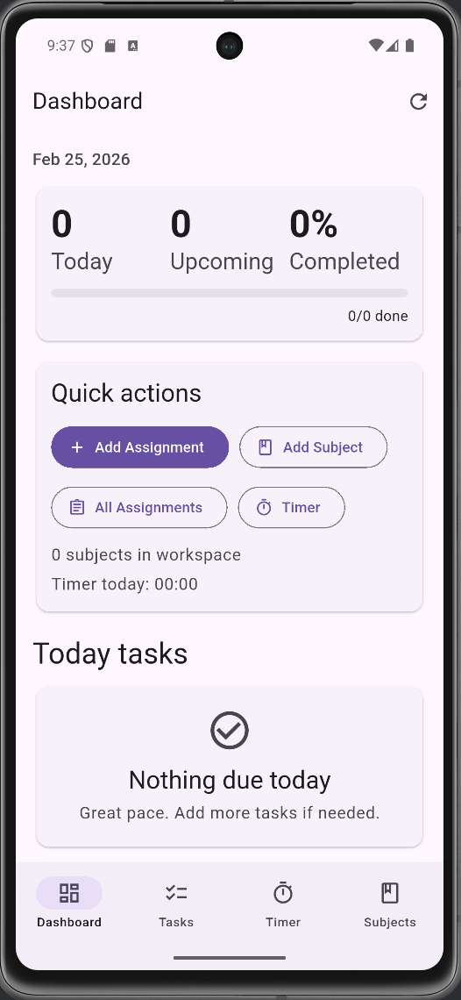
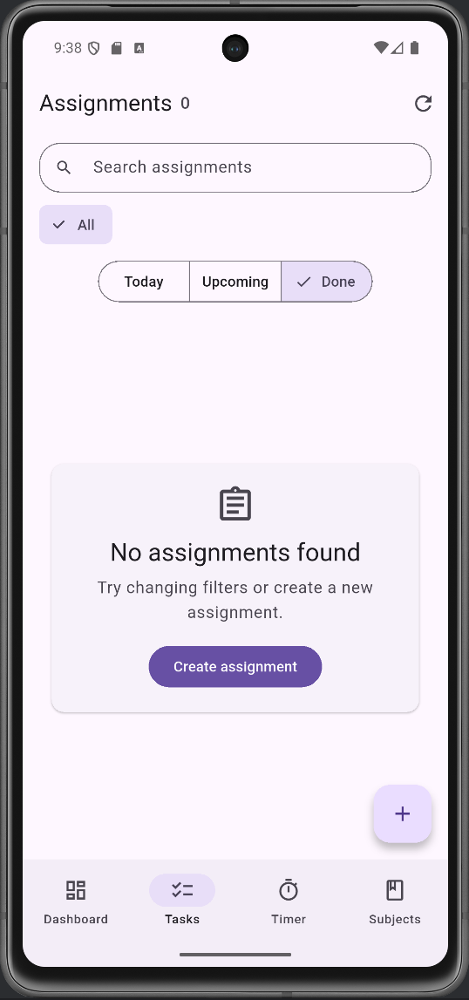
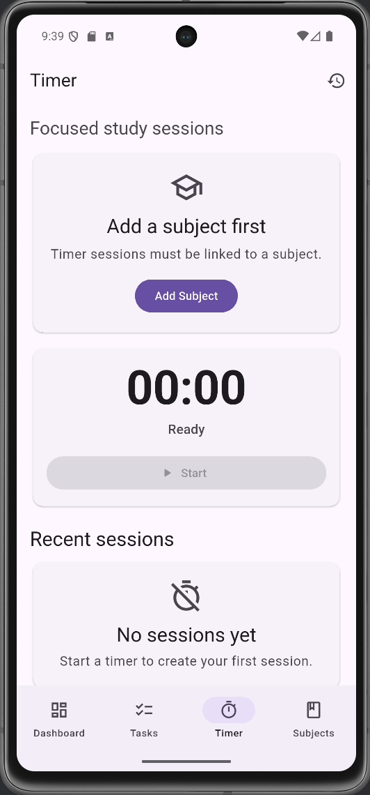

# 🎓 UniTask

UniTask is a productivity-focused Flutter application designed to help students manage assignments, track study sessions, and prioritize tasks effectively.

---

## 📌 Project Overview

UniTask is an **Android-first Flutter app** built with a modular, feature-based architecture.  
It focuses on task prioritization, structured study tracking, and a clean UI for student productivity.

This project demonstrates:
- State management using **Riverpod**
- Clean architecture separation (**presentation / domain / data**)
- **Idempotent timer stop logic** (prevents duplicate saved sessions)
- Persistent local storage using **SharedPreferences**
- Basic test + build setup

---

## 🚀 Features

### 📊 Dashboard
- Upcoming assignments overview
- Today’s focus summary
- Timer session statistics (today)

### ✅ Assignments
- Create / edit / delete assignments
- Priority score calculation (weight + due date)
- Visual priority badge (High / Medium / Low)
- Subject tagging

### ⏱️ Study Timer
- Start / Pause / Resume / Stop
- Automatic session saving
- **Idempotent stop logic** (no duplicate sessions)
- Daily session summary

### 📚 Subjects
- Create and manage subjects
- Link assignments and timer sessions to subjects

---

## 📸 Screenshots

| Dashboard | Assignments | Timer |
|---|---|---|
|  |  |  |

---

## 🛠️ Tech Stack

- **Flutter (Android-first)**
- **Riverpod (State Management)**
- **SharedPreferences (Local Persistence)**
- Material 3 UI

---

## 🧩 Architecture

```text
lib/
├── features/
│   ├── dashboard/
│   ├── assignments/
│   ├── timer/
│   └── subjects/
├── app.dart
└── main.dart
```

Architecture principles:

- Feature-based modular structure
- Presentation / Domain / Data separation
- StateNotifier + AsyncValue pattern

▶️ How to Run

Install dependencies:

flutter pub get

Run the app:

flutter run

Run tests:

flutter test
📱 Build APK
flutter build apk --release

Output location:

build/app/outputs/flutter-apk/app-release.apk
🧠 Reflection

During the development of UniTask, I learned:

How to structure a Flutter app using feature-based architecture

Practical usage of Riverpod for state management

Designing idempotent logic to prevent duplicate data (Timer stop logic)

Managing local persistence safely using SharedPreferences

Handling Git rebase conflicts and maintaining a clean repository

If extended further, I would:

Integrate Firebase for cloud sync

Add authentication

Implement data backup & restore

Add analytics dashboard

This project strengthened my understanding of clean architecture and production-ready Flutter development.

👤 Author

Nithanthip Kulmong
Mae Fah Luang University

📄 License

Educational use only.